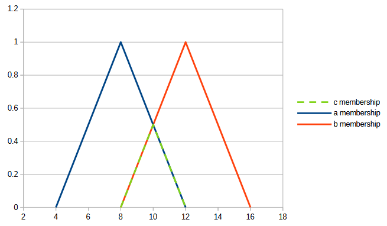
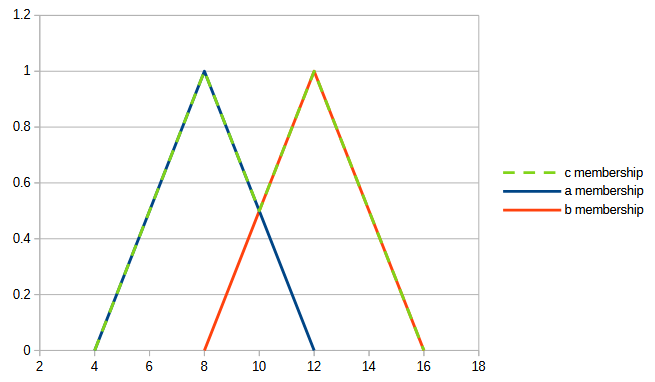
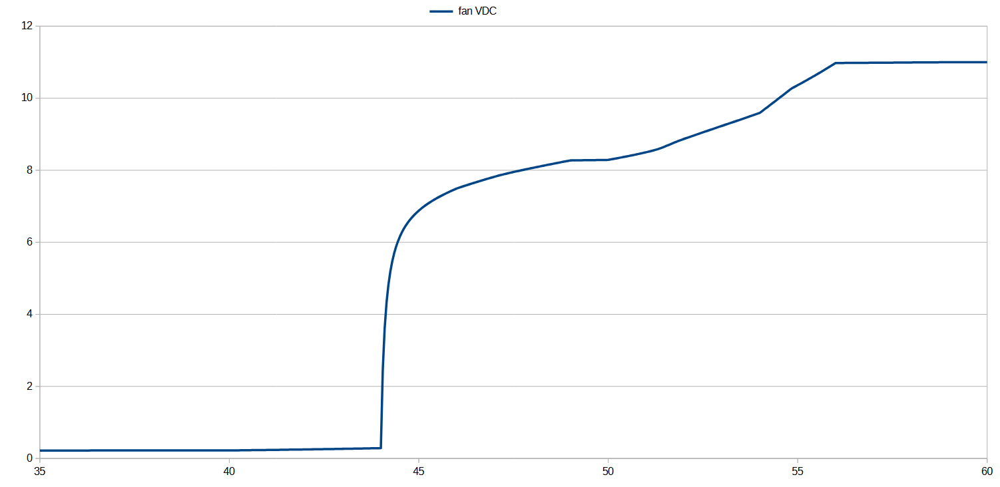
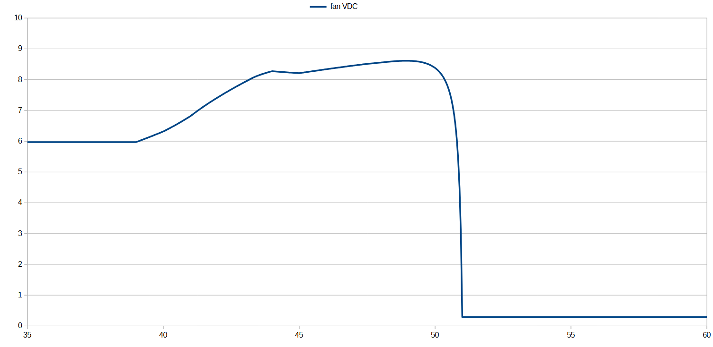

# **fuzzy_cpp**
A header only C++ library for use in a number of problem domains. Applications include control systems, simulations, or any other problem domain where a solution can be modeled with linguistic rules by a domain expert. The library is modeled after fundamental concepts presented in _FUZZY LOGIC : Intelligence, Control, and Information_ by John Yen and Reza Langari.
## Dependencies
1. A C++ compiler that conforms to the ISO C++20 standard specification.
1. An implementation of the C++ standard library that conforms to the ISO C++20 standard specification.
## Usage
Using the fuzzy_cpp library is straightforward and (mostly) idiomatic.  The premise of the library is to make linguistic rules that map an input (antecedent) to an output (consequent). The result of multiple mapping rules must be aggregated (combined) into a single output.  The (fuzzy) output can then be defuzzified into a single (crisp) value.

For example we might model an automatic bathroom fan controller with a single linguistic rule:
1. If humidity is high (antecedent) then fan speed is fast (consequent).

Each of those linguistic terms (humidity, high, fan-speed, fast) would be measured with a fuzzy set.  A fuzzy set is like a classical set, but it's elements have a memberhsip to represent the degree to which those elements belong in the set.

Often in real world scenarios we would want to combine multiple conditions (antecedents) together into a single condition (antecedent).  We would do this using a t-norm (triangular-norm) or t-conorm (triangular-conorm) operation which are set-intersection and set-union respecitively.  T-norm and t-conorm operations may also be applied to existing linguistic terms to form new linguistic terms.
### t-norm
A common t-norm operator in fuzzy logic is minimum.  In this library the C++ bitwise operator& has been overloaded as the t-norm operator.  The particular t-norm operator is selected by which namespace is included in the scope of operation.

Here is what the minimum t-norm operation would look like with the following two sets:
```C++
set a = make_triangle<float>(4, 8, 12);
set b = make_triangle<float>(8, 12, 16);
set c = a & b;
```

### t-conorm
A common t-conorm operator in fuzzy logic is maximum.  In this library the C++ bitwise operator| has been overloaded as the t-conorm operator.  The particular t-conorm operator is selected by which namespace is included in the scope of operation.
```C++
set a = make_triangle<float>(4, 8, 12);
set b = make_triangle<float>(8, 12, 16);
set c = a | b;
```

### antecedent
Antecedents are formed by using the "is" function on two fuzzy sets.  For example a narrow set could represent 'humidity', another set would represent 'high', we could then query whether the humidity is high in C++ by the expression "is(humidity,high)" which creates an antecedent.
### aggregator
Aggregators handle combining the mapping of multiple fuzzy outputs together into a single output.  This is done automatically by the mapping operation, but to do this you must declare an aggregator (C++ variable) for each output range.
### consequent
Consequents are formed for each output variable (aggregator) that is mapped to a particular linguistic output term (fuzzy set).  This is done through the aggregator class' "shall_be" membership function. For example we could say fan_speed shall be fast with the C++ expression "fan_speed.shall_be(fast)" which creates a consequent.
### mapping operation
Mapping operations are where the antecedents are mapped to the consequents.  This can be expressed in C++ using the right shift operator>> with an antecedent for the left hand argument and a consequent for the right hand argument.
## Example
The following example is premised on controlling the fan speed for a root celler depending on the indoor and outdoor tempuratures.  Because there are two variables in this example (indoor tempurature and outdoor tempurature) there are two separate runs to show the output.  The first run displays a Mamdani output for a constant outdoor tempurature.  The second run displays a Mamdani output for a constant indoor tempurature.
```C++
#include <fuzzy.hpp>
// ...
    using namespace fuzzy;

    set const cold{ {-60.0f, 1.0f}, {40.0f, 1.0f}, {45.0f, 0.0f } };
    set const chilly = make_triangle<float>(40.0f, 45.0f, 50.0f);
    set const cool = make_triangle<float>(45.0f, 50.0f, 55.0f);
    set const warm{ {50.0f, 0.0f}, {55.0f, 1.0f}, {130.0f, 1.0f } };
    set const less_than_warm = [&]()
    {
        using namespace fuzzy::operators::tconorm::bounded_sum;
        return cold | chilly | cool;
    }();
    set const more_than_chilly = [&]()
    {
        using namespace fuzzy::operators::tconorm::bounded_sum;
        return cool | warm;
    }();

    set const off{ {0.0f, 1.0f}, {0.5f, 0.0f} };
    set const slow = make_triangle<float>(4.5f, 5.0f, 8.5f);
    set const medium = make_triangle<float>(5.0f, 8.5f, 12.0f);
    set const fast{ {8.5f, 0.0f}, {12.0f, 1.0f}, {12.5f, 1.0f} };

    auto control_loop_mamdani = [&](float indoor_tempurature, float outdoor_tempurature)
    {
        set const it = make_value<float>(indoor_tempurature);
        set const ot = make_value<float>(outdoor_tempurature);

        using namespace fuzzy::models::mamdani;
        aggregator fan_voltage;

        is(it, cold) >> fan_voltage.shall_be(off);
        (is(it, cool) & is(ot, cold)) >> fan_voltage.shall_be(slow);
        (is(it, cool) & is(ot, chilly)) >> fan_voltage.shall_be(medium);
        (is(it, warm) & is(ot, less_than_warm)) >> fan_voltage.shall_be(fast);
        (is(it, chilly) & is(ot, more_than_chilly)) >> fan_voltage.shall_be(off);

        return center_of_area(fan_voltage.result());
    };

    std::cout << "-------------------- Mamdani Const Outdoor Temp --------------------\n";
    std::cout << "outdoor tempurature F, indoor tempurature F, fan VDC\n";
    for (float it = 35.0f; it <= 60.0f; it += 0.05f)
    {
        float fv = control_loop_mamdani(it, 44.0f);
        std::cout << "44.0f, " << it << ", " << fv << "\n";
    }

    std::cout << "-------------------- Mamdani Const Indoor Temp --------------------\n";
    std::cout << "indoor tempurature F,outdoor tempurature F, fan VDC\n";
    for (float ot = 35.0f; ot <= 60.0f; ot += 0.05f)
    {
        float fv = control_loop_mamdani(49.0f, ot);
        std::cout << "49.0f, " << ot << ", " << fv << "\n";
    }
```


## Constexpr Friendly
fuzzy_cpp is constexpr friendly! The following sample is one way of achieving a constexpr output from a fuzzy operation:
```C++
#include <fuzzy.hpp>
// ...
    using namespace fuzzy;

    constexpr auto ce_control_loop_mamdani = [](float indoor_tempurature, float outdoor_tempurature)
    {
        set const cold{ {-60.0f, 1.0f}, {40.0f, 1.0f}, {45.0f, 0.0f } };
        set const chilly = make_triangle<float>(40.0f, 45.0f, 50.0f);
        set const cool = make_triangle<float>(45.0f, 50.0f, 55.0f);
        set const warm{ {50.0f, 0.0f}, {55.0f, 1.0f}, {130.0f, 1.0f } };

        set const off{ {0.0f, 1.0f}, {0.5f, 0.0f} };
        set const slow = make_triangle<float>(4.5f, 5.0f, 8.5f);
        set const medium = make_triangle<float>(5.0f, 8.5f, 12.0f);
        set const fast{ {8.5f, 0.0f}, {12.0f, 1.0f}, {12.5f, 1.0f} };

        set const it = make_value<float>(indoor_tempurature);
        set const ot = make_value<float>(outdoor_tempurature);

        using namespace fuzzy::models::mamdani;
        aggregator fan_voltage;

        is(it, cold) >> fan_voltage.shall_be(off);
        (is(it, cool) & is(ot, cold)) >> fan_voltage.shall_be(slow);
        (is(it, cool) & is(ot, chilly)) >> fan_voltage.shall_be(medium);
        (is(it, warm) & is(ot, (cold | chilly | cool))) >> fan_voltage.shall_be(fast);
        (is(it, chilly) & is(ot, cool | warm)) >> fan_voltage.shall_be(off);

        return center_of_area(fan_voltage.result());
    };

    constexpr float v0 = ce_control_loop_mamdani(49.0f, 44.0f);
    static_assert(equivelant(v0, 8.27334f));
```
## Future Work
1. Test use of std::pmr::memory_resource with std::pmr::polymorphic_allocator for stack based allocator for the set container.   fuzzy_cpp has been designed to support this with its current template parameters but this has not been tested and type names have not been added.
1. Add a customized non-throwing container/allocator and type names for use in embedded environments.

> [!NOTE]
> Pull requests in these areas are welcome!


